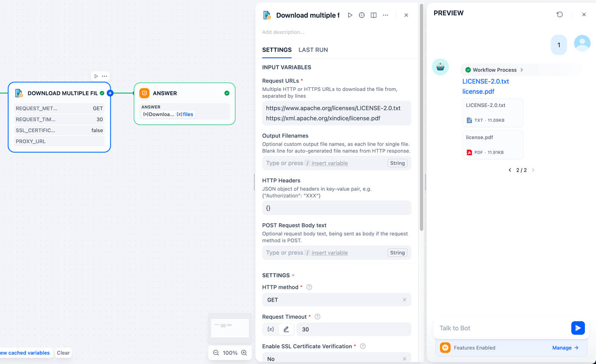

# Download - File downloader

**Author:** [bowenliang123](https://github.com/bowenliang123)

**Github Repository:** https://github.com/bowenliang123/dify-plugin-download

**Dify Marketplace:** https://marketplace.dify.ai/plugins/bowenliang123/download

## Overview

Download files from give URLs to Dify files.

## Key Features

- 🚀 **HTTP/2 support**
- 🌊 **Streaming transporting**
- 💫 **Concurrent downloads**
- ⚡ **GET / POST method**
- 🎨 **Custom output filenames**
- 🌼 **Custom HTTP headers**
- 🌊 **HTTP / HTTPS / SOCKS proxy support**
- 🔄 **HTTP redirection auto-handling**
- 🌟 **Timout controls**
- ✨ **SSL certificate verification options**

## Tool Descriptions

### Download Single File

- tool: `single_file_download`
- inputs:
    - URL to download file from
    - Optional:
      - custom filename for the downloaded file
      - HTTP method to use, either `GET` or `POST`
      - HTTP headers in JSON format, one header per line
      - Proxy URL, supporting `http://`, `https://`, `socks5://`
      - enable or disable SSL certificate verification

### Download Multiple Files

- tool: `multiple_file_download`
- inputs:
    - URLs to download file from, one URL per line
    - Request Timeout in seconds
    - Optional: 
      - Custom filename for the downloaded files, one filename per line
      - HTTP method to use, either `GET` or `POST`
      - HTTP headers in JSON format, one header per line
      - Proxy URL, supporting `http://`, `https://`, `socks5://`
      - enable or disable SSL certificate verification

multiple_file_download_1.png

---

## Changelog

- 0.0.1:
    - add `single_file_download` and `multiple_file_download` tool, support downloading single and multiple file from
      URL(s)
    - support HTTP 301/302 redirection
    - support enabling / disabling SSL certificate verification

## License

- Apache License 2.0

## Privacy

This plugin collects no data.

All the file transformations are completed locally. NO data is transmitted to third-party services.

